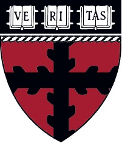

<h1 id="About me" style="border-bottom: 2px solid #d3d3d3;">👀 About me: <a href="https://zhouhengli.github.io">https://zhouhengli.github.io/</a></h1>

 
    I am currently a 3rd year Ph.D. student in the College of Control Science and Engineering at  Zhejiang University, Hangzhou, China, under the supervision of  <a href="https://scholar.google.com.hk/citations?hl=zh-CN&user=7ZZ_-m0AAAAJ" target=_blank  >Prof. Lei Xie</a> and <a href="https://scholar.google.com.hk/citations?hl=zh-CN&user=9rfFRjgAAAAJ" target=_blank  >Prof. Hongye Su</a>. 
    I will be visiting the <a href="https://kempnerinstitute.harvard.edu/" target=_blank  >Kempner Institute</a> at  
    Harvard University's John A. Paulson School of Engineering and Applied Sciences (SEAS) starting in December 2025, supervised by <a href="https://yilundu.github.io/" target=_blank  >Prof. Yilun Du</a>. During the visit, my research will focus on safe, high-mobility trajectory planning methods with out-of-distribution generalization ability.
Before joining Zhejiang University, I interned at Hikvision Research Institute in Hangzhou, where I applied optimization methods for manipulators with ROS. ✨ Enjoyments of life: 🲠Board Games (Splendor, Seven Wonders: Duel, etc), 👣 hiking, 🾠tennis, 📠ping-pong, ğŸ—ºï¸ traveling. 

 

  <h1 id="Research-section">🎯 Research</h1>

 
    My ultimate goal is to develop embodied intelligent vehicles capable of seamlessly interacting with the physical world. To achieve this, my research focuses on decision-making methods powered by generative models and optimization-based trajectory planning methods designed for afety. Currently, I am exploring planning approaches for both single and multi-vehicle systems in autonomous racing and drifting, with a focus on the following key areas:  
    ⭐ <strong>afe Decision-Making and planning Using Generative Models</strong>: Using energy-based models (EBMs) for decision-making, while ensuring afety through model-based planning methods.    
    ⭐ <strong>Integrated Trajectory Planning and Control</strong>: Aggressive vehicle motion is guaranteed by optimizing the velocity distribution within the MPC prediction horizon when planning racing trajectories.       
    ⭐ <strong>Learning-Based Parameter Tuning for Motion Planners</strong>: Leveraging post-race data to optimize planner performance and push the boundaries of the vehicle's racing capabilities.      
    I am also actively involved in applying these techniques to <a href="https://f1tenth.org/" style="text-decoration: none;" target=_blank >F1TENTH competition</a>. <strong>Feel free to drop me emails</strong> (📨 zh.li@zju.edu.cn) if you are interested in the topics mentioned above, I would be happy to discuss further collaborations.

 

  <h1 id="Project-section">👨‍💻 Project statistics</h1>

